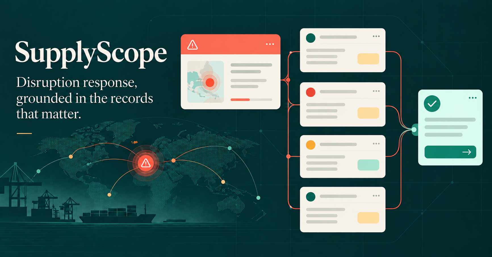
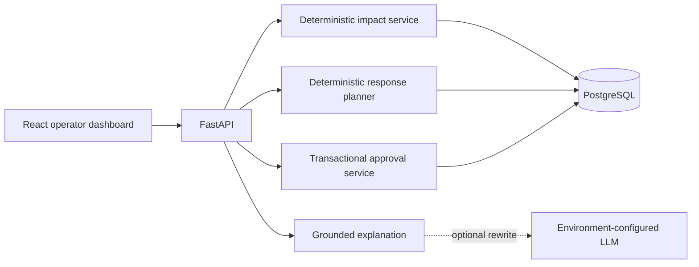

# SupplyScope

[](https://github.com/poolanithinreddy/SupplyScope/actions/workflows/ci.yml)
[](LICENSE)
[](backend/requirements.txt)
[](package.json)

SupplyScope is a portfolio-quality disruption response platform for the fictional logistics company **Northstar Freightworks**. It connects synthetic supplier, shipment, inventory, facility, and order records so an operator can identify exposure, compare deterministic recovery options, create a side-effect-free proposal, approve it, and inspect the resulting audit trail.



> All business records in this repository are synthetic. SupplyScope does not represent a production deployment, real customers, or real company data.

## What the demo proves

- Dependency-correct impact detection: an order is flagged only when its active allocations cannot satisfy the quantity by the promise date.
- Transparent calculations: the UI shows the records and formula inputs behind shortage, projected date, and urgency.
- Deterministic response planning: transfer stock, lead time, supplier eligibility, and capacity are checked in Python—not by an LLM.
- Safe approvals: proposal creation has no inventory effects; approval rechecks constraints, reserves supply transactionally, and is idempotent.
- Complete replay: reset restores the synthetic scenario for another walkthrough.
- Graceful portfolio mode: the React app includes the same deterministic scenario locally, so the flow remains explorable when the API is offline.

## Stack

- React 19 + TypeScript, rendered with vinext/Vite
- FastAPI + SQLAlchemy 2 + Alembic
- PostgreSQL 16 in Docker Compose; SQLite for fast isolated tests
- Deterministic explanation fallback with an optional environment-configured Responses-compatible LLM
- Node render tests, browser-flow verification, and pytest API tests

## Architecture



The database is the source of truth. The LLM is strictly outside the decision path: it may rewrite an already-computed explanation, but cannot determine exposure, quantities, feasibility, ranking, reservations, or approval outcomes.

## Run the full application

The only prerequisite is Docker Desktop with Compose.

```bash
docker compose up --build
```

Open:

- Web app: http://localhost:3000
- API docs: http://localhost:8000/docs
- Health check: http://localhost:8000/health

Reset the demo from the UI or with:

```bash
curl -X POST http://localhost:8000/api/scenario/reset
```

## Local development

Frontend:

```bash
npm ci
npm run dev
```

Backend:

```bash
cd backend
python -m venv .venv
source .venv/bin/activate
pip install -r requirements.txt
uvicorn app.main:app --reload
```

Environment keys are documented in `.env.example`. `LLM_API_KEY` is optional; without it, the grounded deterministic explanation is returned. The model only rewrites that explanation. It never controls quantities, feasibility, urgency, or approvals.

## Test

```bash
npm test
cd backend && pytest -q
```

The backend flow test verifies risk detection, all three response states, side-effect-free proposal creation, approval, outlook recovery, audit creation, idempotent retry behavior, rejection of infeasible proposals, and stale-approval rejection when a competing approval consumes the same stock.

Current verification: **2 frontend checks + 6 backend workflow tests**, plus ESLint and Docker Compose configuration validation.

## Seeded scenario

Scenario date: **September 28, 2026**.

| Record | Expected result | Manual check |
| --- | --- | --- |
| `ORD-4821` | Critical risk | Needs 50 `AX-440`; 10 are ready and 40 depend on delayed `INB-7392`. Promise Oct 05; projected Oct 10; shortage 40. |
| `ORD-4824` | High risk | Needs 30 `AX-440`; 5 are ready and 25 depend on `INB-7392`. Promise Oct 07; projected Oct 10; shortage 25. |
| `ORD-4830` | Not at risk | All 20 `LM-210` units are covered by on-hand allocation before the Oct 08 promise. |
| `ORD-4799` | Excluded | Fulfilled orders do not appear in active risk calculations. |
| `ORD-4804` | Excluded | Cancelled orders do not appear in active risk calculations. |

For `ORD-4821`, the seeded recovery choices demonstrate every feasibility state:

| Option | Capacity | Arrival | Result |
| --- | ---: | --- | --- |
| Transfer from `DFW-02` | 60 unreserved | Sep 30 | Feasible, on time |
| Alternate supplier `SUP-NOR` | 90 | Oct 03 | Feasible, on time |
| Reorder from `SUP-MER` | 120 | Oct 07 | Feasible, 2 days late |
| Alternate supplier `SUP-EAS` | 18 | Oct 02 | Infeasible; 40 required |

## Urgency formula

```text
urgency = priority weight
        + shortage ratio × 35
        + projected late days × 6
        + deadline pressure
```

Priority weights are critical `35`, high `24`, and standard `12`. Deadline pressure is `max(0, 20 − days until promise × 2)`. The UI exposes every input. This score ranks the queue; it is not used to decide feasibility or approval.

## Approval invariants

1. `POST /api/proposals` validates the displayed option and stores intent only.
2. `POST /api/proposals/{id}/approve` requires an actor and idempotency key.
3. Approval locks the proposal and the selected inventory/capability rows, then rechecks availability.
4. A stale proposal is rejected without supply effects and recorded in the audit log.
5. A successful approval creates one reservation/commitment, one recovery shipment, updated allocations, and audit events in one database transaction.
6. Unique constraints prevent a proposal from being applied twice and make retries safe.

## Repository map

```text
app/                       React operator experience
backend/app/               FastAPI routes, models, calculations, seeding
backend/alembic/           Database migration
backend/tests/             End-to-end API flow tests
tests/                     Frontend server-render test
docker-compose.yml         PostgreSQL + API + web demo
.github/workflows/ci.yml   GitHub Actions verification
```

## Key API routes

| Method | Route | Purpose |
| --- | --- | --- |
| `GET` | `/api/dashboard` | Ranked active outlooks and disruption summary |
| `GET` | `/api/orders/{id}` | Dependency evidence, calculation, and response options |
| `POST` | `/api/orders/{id}/explain` | Record-grounded explanation |
| `POST` | `/api/proposals` | Create a proposal without inventory effects |
| `POST` | `/api/proposals/{id}/approve` | Recheck and atomically apply a response |
| `GET` | `/api/audit` | Decision and inventory event history |
| `POST` | `/api/scenario/reset` | Restore the synthetic baseline |

## Interview walkthrough

Start at the control tower, open `ORD-4821`, inspect the supplier → shipment → inventory → order chain, ask why the order is at risk, compare the transfer with the alternate supplier, and create the transfer proposal. Point out that the shortage stays at 40 until the separate approval. Approve it, confirm the order becomes recovered, then open Decision log to show the recheck, reservation, and outlook events. Finish by resetting the scenario.
